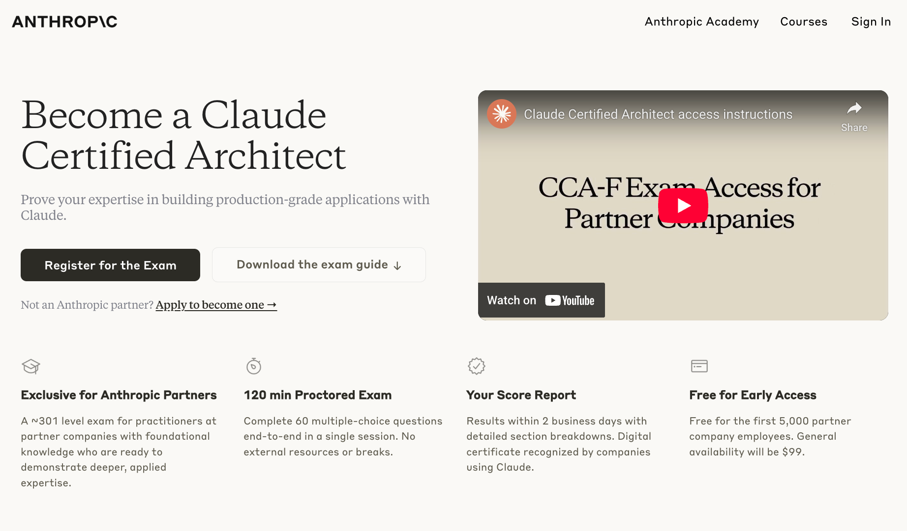
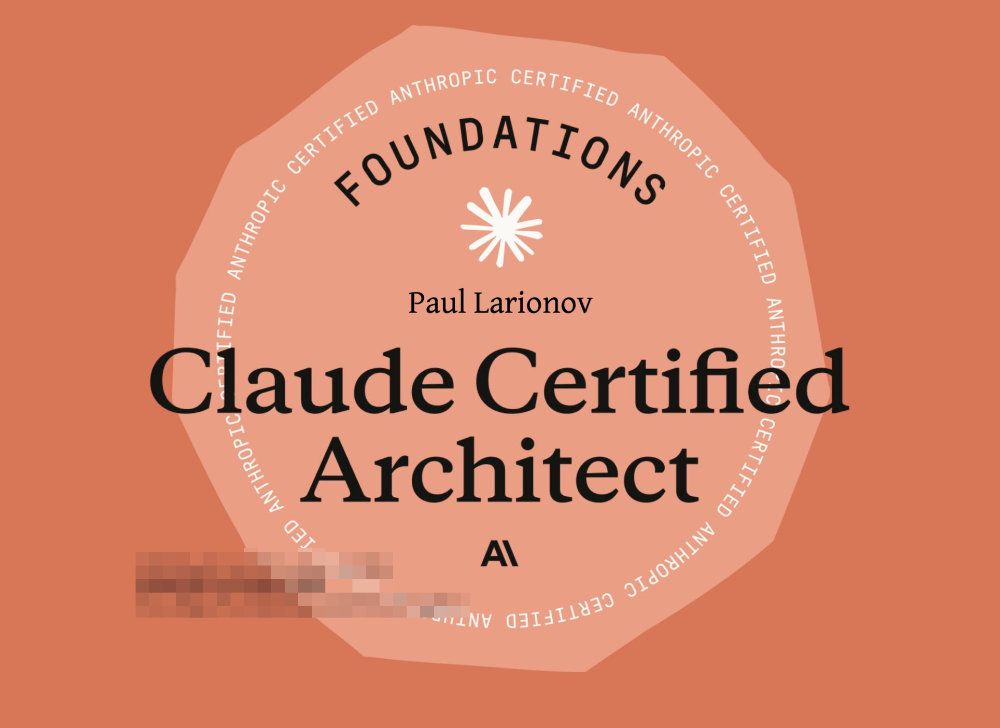

# Claude Certified Architect — Foundations

This repository contains study materials for the **Claude Certified Architect — Foundations** certification.

## Certificate Example

## Course Access

- To request access to the official course/exam portal, use this link: https://anthropic.skilljar.com/claude-certified-architect-foundations-access-request

## Study Guide

- **English guide**: [`guide_en.md`](./guide_en.md)
- **Spanish guide**: [`guide_es.md`](./guide_es.md)
- **Russian guide**: [`guide_ru.md`](./guide_ru.md)
- **Chinese guide**: [`guide_zh.md`](./guide_zh.md)
- **Japanese guide**: [`guide_ja.md`](./guide_ja.md)
- **Urdu guide**: [`guide_ur.md`](./guide_ur.md)
- **Arabic guide**: [`guide_ar.md`](./guide_ar.md)
- **Hebrew guide**: [`guide_he.md`](./guide_he.md)
- **Korean guide**: [`guide_ko.md`](./guide_ko.md)
- **Italian guide**: [`guide_it.md`](./guide_it.md)
- **Traditional Chinese (Taiwan) guide**: [`guide_zh-tw.md`](./guide_zh-tw.md)
- **Vietnamese guide**: [`guide_vi.md`](./guide_vi.md)
- **Turkish guide**: [`guide_tr.md`](./guide_tr.md)
- **French guide**: [`guide_fr.md`](./guide_fr.md)
- **Portuguese (Brazil) guide**: [`guide_pt-br.md`](./guide_pt-br.md)

## PDF Version

- **English guide**: [`guide_en.pdf`](./pdf/guide_en.pdf)
- **Spanish guide**: [`guide_es.pdf`](./pdf/guide_es.pdf)
- **Russian guide**: [`guide_ru.pdf`](./pdf/guide_ru.pdf)
- **Chinese guide**: [`guide_zh.pdf`](./pdf/guide_zh.pdf)
- **Japanese guide**: [`guide_ja.pdf`](./pdf/guide_ja.pdf)
- **Urdu guide**: [`guide_ur.pdf`](./pdf/guide_ur.pdf)
- **Arabic guide**: [`guide_ar.pdf`](./pdf/guide_ar.pdf)
- **Hebrew guide**: [`guide_he.pdf`](./pdf/guide_he.pdf)
- **Korean guide**: [`guide_ko.pdf`](./pdf/guide_ko.pdf)
- **Italian guide**: [`guide_it.pdf`](./pdf/guide_it.pdf)
- **Traditional Chinese (Taiwan) guide**: [`guide_zh-tw.pdf`](./pdf/guide_zh-tw.pdf)
- **Vietnamese guide**: [`guide_vi.pdf`](./pdf/guide_vi.pdf)
- **Turkish guide**: [`guide_tr.pdf`](./pdf/guide_tr.pdf)
- **French guide**: [`guide_fr.pdf`](./pdf/guide_fr.pdf)
- **Portuguese (Brazil) guide**: [`guide_pt-br.pdf`](./pdf/guide_pt-br.pdf)

## EPUB Version

- **English guide**: [`guide_en.epub`](./epub/guide_en.epub)
- **Spanish guide**: [`guide_es.epub`](./epub/guide_es.epub)
- **Russian guide**: [`guide_ru.epub`](./epub/guide_ru.epub)
- **Chinese guide**: [`guide_zh.epub`](./epub/guide_zh.epub)
- **Japanese guide**: [`guide_ja.epub`](./epub/guide_ja.epub)
- **Urdu guide**: [`guide_ur.epub`](./epub/guide_ur.epub)
- **Arabic guide**: [`guide_ar.epub`](./epub/guide_ar.epub)
- **Hebrew guide**: [`guide_he.epub`](./epub/guide_he.epub)
- **Korean guide**: [`guide_ko.epub`](./epub/guide_ko.epub)
- **Italian guide**: [`guide_it.epub`](./epub/guide_it.epub)
- **Traditional Chinese (Taiwan) guide**: [`guide_zh-tw.epub`](./epub/guide_zh-tw.epub)
- **Vietnamese guide**: [`guide_vi.epub`](./epub/guide_vi.epub)
- **Turkish guide**: [`guide_tr.epub`](./epub/guide_tr.epub)
- **French guide**: [`guide_fr.epub`](./epub/guide_fr.epub)
- **Portuguese (Brazil) guide**: [`guide_pt-br.epub`](./epub/guide_pt-br.epub)

## Anki Deck (Practical Test)

- **English**: [`practical_test_en.apkg`](./anki/practical_test_en.apkg)
- **French**: [`practical_test_fr.apkg`](./anki/practical_test_fr.apkg)
- **Japanese**: [`practical_test_ja.apkg`](./anki/practical_test_ja.apkg)
- **Korean**: [`practical_test_ko.apkg`](./anki/practical_test_ko.apkg)
- **Russian**: [`practical_test_ru.apkg`](./anki/practical_test_ru.apkg)
- **Chinese**: [`practical_test_zh.apkg`](./anki/practical_test_zh.apkg)
- **Portuguese (Brazil)**: [`practical_test_pt-br.apkg`](./anki/practical_test_pt-br.apkg)
- **Spanish**: [`practical_test_es.apkg`](./anki/practical_test_es.apkg)

## Video Materials
- **English**: [`NotebookML`](https://notebooklm.google.com/notebook/4ffc65a7-5395-4a36-8832-23ed9b57f369)

## How to Use

- Read the guide that matches your preferred language.
- Work through the scenarios and questions.
- Use the **Practical Exercises** section to rehearse key patterns (tool design, MCP integration, structured output, context management, and reliability).

## Free Anthropic Courses

13 free courses & certificates from Anthropic Academy:

1. **[Claude 101](https://anthropic.skilljar.com/claude-101)** — Learn Claude for everyday work. Core features and best practices.
2. **[AI Fluency: Framework & Foundations](https://anthropic.skilljar.com/ai-fluency-framework-foundations)** — The foundational thinking course.
3. **[Introduction to Agent Skills](https://anthropic.skilljar.com/introduction-to-agent-skills)** — Build, configure, and share Skills in Claude Code.
4. **[Building with the Claude API](https://anthropic.skilljar.com/claude-with-the-anthropic-api)** — Function calling, tool use, streaming, SDKs, and production patterns.
5. **[Claude Code in Action](https://anthropic.skilljar.com/claude-code-in-action)** — Integrate Claude Code into your dev workflow.
6. **[Intro to Model Context Protocol](https://anthropic.skilljar.com/introduction-to-model-context-protocol)** — Build MCP servers and clients from scratch in Python.
7. **[MCP: Advanced Topics](https://anthropic.skilljar.com/model-context-protocol-advanced-topics)** — Sampling, notifications, file system access, and transport for production MCP servers.
8. **[AI Fluency for Students](https://anthropic.skilljar.com/ai-fluency-for-students)** — AI skills for learning, career planning, and academic success.
9. **[AI Fluency for Educators](https://anthropic.skilljar.com/ai-fluency-for-educators)** — For faculty and instructional designers applying AI Fluency into teaching.
10. **[Teaching AI Fluency](https://anthropic.skilljar.com/teaching-ai-fluency)** — Teach and assess AI Fluency in instructor-led settings.
11. **[AI Fluency for Nonprofits](https://anthropic.skilljar.com/ai-fluency-for-nonprofits)** — Increase organizational impact while staying mission-true.
12. **[Claude with Amazon Bedrock](https://anthropic.skilljar.com/claude-in-amazon-bedrock)** — The full AWS accreditation course, now open to everyone.
13. **[Claude with Google Cloud's Vertex AI](https://anthropic.skilljar.com/claude-with-google-vertex)** — Work with Claude through Google Cloud's Vertex AI, from setup to production.

## See Also

- Claude Code: Commands Cheatsheet https://claude-guides.com
- Top 80 Claude Skills, Agents & GitHub Repos for AI — The Complete Guide https://x.com/paullarionov/status/2038254131849134220
- Claude Certified Architect in Spanish — study guides for Foundations and Professional, an EN→ES glossary, and a free 163-question practice simulator (no signup) https://github.com/juanmartincoma-collab/claude-certified-architect-es
- [Free timed practice exams for all four Claude certifications](https://youraidept.com/network/claude-certification-practice-exam): full-length mocks drawn to the published domain weights (60/120 for CCAR-F and CCAO-F, 53/120 for CCDV-F, 63/120 for CCAR-P), scored against the 720 pass mark with a per-domain breakdown and explanations. 333 original questions, no sign-up, from YAID, a Claude Partner Network firm.

## How to Contribute

- Add new translations to your language in md files, PDF version will be generated automatically after merge of PR.

## Follow

- LinkedIn: https://www.linkedin.com/in/paullarionov
- X: https://x.com/paullarionov

